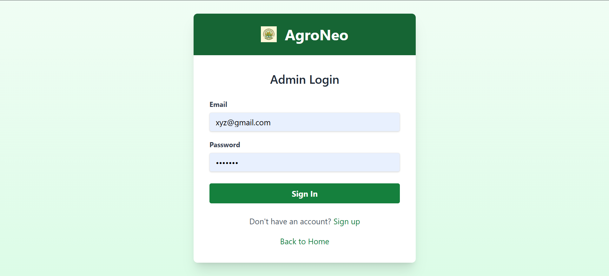
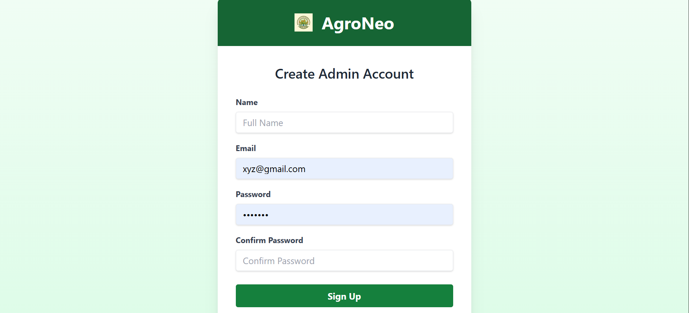
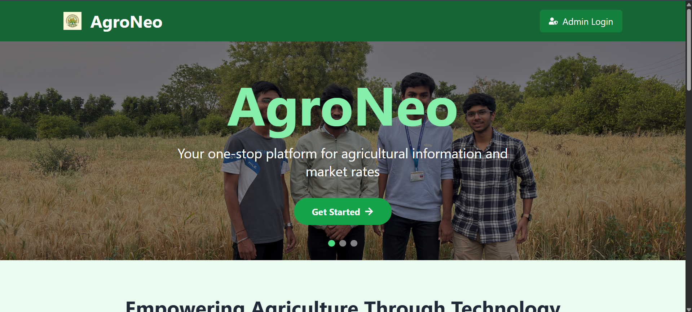
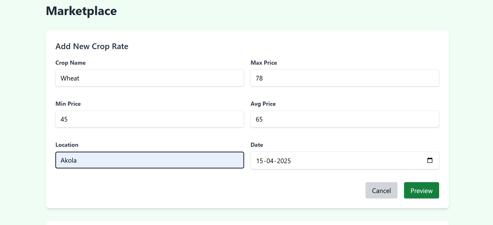
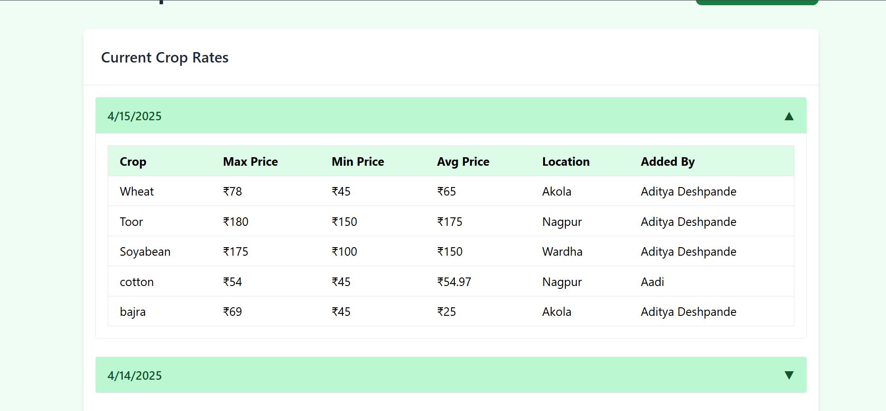

<h1 align="center">AGRONEO</h1>

<h2 align="center">Smart Agriculture Web Portal</h2>

A full-stack agricultural platform that provides daily crop rates based on location and date, enabling farmers to access transparent and reliable market information.

<h2>About AGRONEO</h2>

<ul>
  <li>AGRONEO is a community-focused agricultural information system.</li>
  <li>It bridges the gap between farmers and real-time market pricing.</li>
  <li>Admins manage and publish crop rate data.</li>
  <li>Farmers consume accurate, location-based prices via web and mobile applications.</li>
  <li>The system is designed with scalability and real-world usability in mind.</li>
</ul>

<h2>Core Features</h2>

<ul>
  <li>Secure admin authentication with login and registration.</li>
  <li>Daily crop rate management with add, update, and delete functionality.</li>
  <li>Location-based pricing for regional accuracy.</li>
  <li>Date-wise crop rate records for historical tracking.</li>
  <li>RESTful API integration using Express.js.</li>
  <li>Notification support on the mobile application side.</li>
  <li>Persistent and secure data storage using MySQL.</li>
</ul>

<h2>Application Screenshots</h2>

<table align="center">
  <tr>
    <td align="center">
      <h3>Login</h3>
      
    </td>
    <td align="center">
      <h3>Register</h3>
      
    </td>
  </tr>

  <tr>
    <td align="center">
      <h3>Home</h3>
      
    </td>
    <td align="center">
      <h3>Marketplace</h3>
      
    </td>
  </tr>

  <tr>
    <td align="center" colspan="2">
      <h3>Current Crop Prices</h3>
      
    </td>
  </tr>
</table>

<h2>Technology Stack</h2>

<h3>Frontend</h3>
<ul>
  <li>HTML</li>
  <li>CSS</li>
  <li>JavaScript</li>
</ul>

<h3>Backend</h3>
<ul>
  <li>Node.js</li>
  <li>Express.js</li>
</ul>

<h3>Database</h3>
<ul>
  <li>MySQL</li>
</ul>

<h2>Backend Setup</h2>

<ul>
  <li>Navigate to the backend directory.</li>
  <li>Install required dependencies.</li>
</ul>

<pre>
cd backend
npm install
</pre>

<ul>
  <li>Start the backend server.</li>
</ul>

<pre>
node server.js
</pre>

<h2>Frontend Setup</h2>

<ul>
  <li>Open <code>frontend/index.html</code> in a web browser.</li>
  <li>Connect frontend forms to backend APIs using JavaScript <code>fetch()</code>.</li>
</ul>

<h2>REST API Endpoints</h2>

<ul>
  <li>
    <b>POST</b> <code>/api/auth/register</code>
    <ul>
      <li>Registers a new admin user.</li>
    </ul>
  </li>

  <li>
    <b>POST</b> <code>/api/auth/login</code>
    <ul>
      <li>Authenticates admin and grants access.</li>
    </ul>
  </li>

  <li>
    <b>POST</b> <code>/api/crops/add</code>
    <ul>
      <li>Adds a new crop rate (admin-only operation).</li>
    </ul>
  </li>

  <li>
    <b>GET</b> <code>/api/crops/:location</code>
    <ul>
      <li>Fetches crop rates for a specific location.</li>
    </ul>
  </li>

  <li>
    <b>GET</b> <code>/api/crops/:location/:date</code>
    <ul>
      <li>Fetches crop rates for a specific location on a given date.</li>
    </ul>
  </li>
</ul>

<h2>Sustainability and Community Impact</h2>

<ul>
  <li>Enables farmers to make informed selling decisions through transparent pricing.</li>
  <li>Strengthens local agricultural markets by improving price awareness.</li>
  <li>Designed for scalability across regions and datasets.</li>
  <li>Supports data-driven decision-making in rural communities.</li>
</ul>

